# Manual Test Plan

## Intial Setup

Please refer to the readme

## Popup Bubble
- Navigate to a website https://en.wikipedia.org/wiki/Dog for example

- Double click on the word contribute on the left of the page

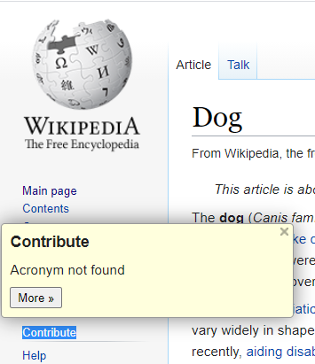

- The popup should show up and and not go off the screen

- Now test closing the popup by clicking elsewhere on the screen

## Add Acronym
- Navigate to a website that has an acronym https://www.acronymfinder.com/YAHOO.html for example

- Double click on the word Yahoo

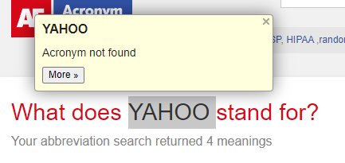

- Next click the More button

- The add acronym page should have been opened up

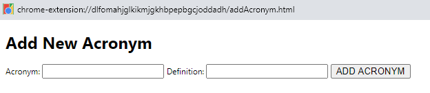

- Type in a test acronym Yahoo and Test and then click "ADD ACRONYM"

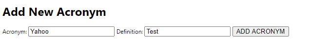

- Go back to the page with the acronym and double click on it.

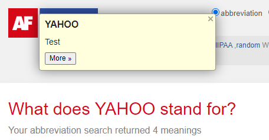

- The definition should show up as Test

## Update Acronym
- Navigate to a website that has an acronym https://www.acronymfinder.com/YAHOO.html for example

- Double click on the word Yahoo

- Next click the More button

- The acronym page should have been opened up

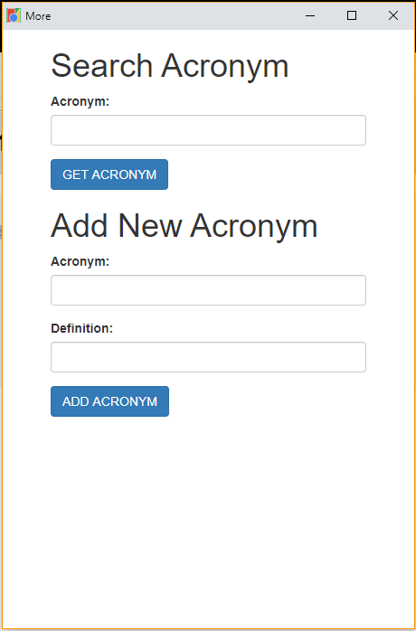

- Type in Yahoo and then click "GET ACRONYM"

- Modify the Edit Text box that shows up to say 'Updated' and click 'UPDATE ACRONYM'

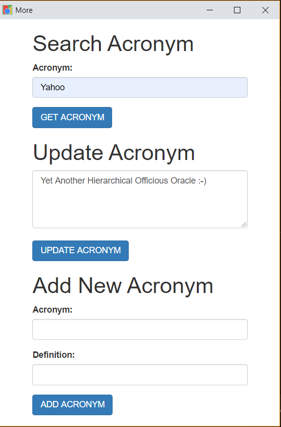

- Go back to the page with the acronym and double click on it.

- The definition should show up as 'Updated'
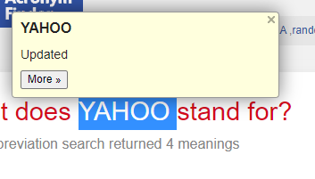

## Search Box
- Navigate to the top right where the extensions show up.

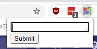

- Clicking on the extension will display a search box. Enter 'Yahoo' into it and click submit

- The definition should be displayed in that window

## Settings Page

- Right Click in the top right where the extensions show up

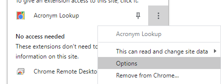

- Choose Options

- You should be navigated to an Options page

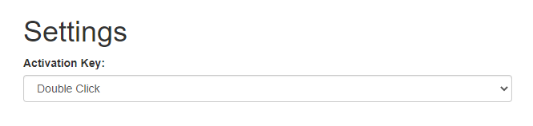

## Viewing Multiple Definitions

- Double click on an acronym that has two definitions in the database.

- You should see two arrows at the bottom

- One should be disabled. Click the >> button

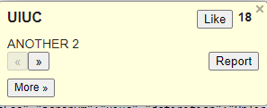

- Verify that the definitions switches

- Verify that the next button cannot be pressed

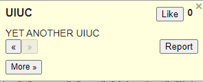

## Report Acronym

- Double click on an acronym that is in the database to bring up the popup

- Click the report button twice

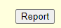

- This acronym should no longer show up in the list since it has been reported twice. 

## Like Acronym

- Double click on an acronym that is in the database to bring up the popup

- Click the like button

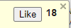

- Verify that the like count goes up