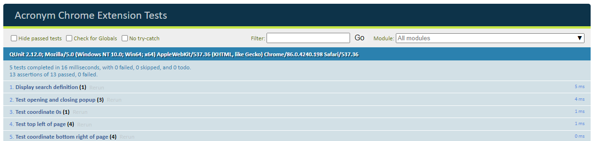

# Custom-Acronym-Definer-Extension

Chrome extension that will define an acronym based on a custom uploaded dictionary.

This extension is only compatible with Chrome

https://github.com/Custom-Acronym/Custom-Acronym-Definer-Extension/tree/main

## Setup

- First open up the Chrome browser and navigate to the extensions in the settings.

- Then select 'Load unpacked' from the buttons in the top left.

- Navigate to the folder where the extension is located.

- The extension should now be enabled.

## Testing

Testing uses Qunit

Locally open test.html in the browser. The test results are displayed like the following.

Read the ManualTestPlan.md to perform manual tests.
